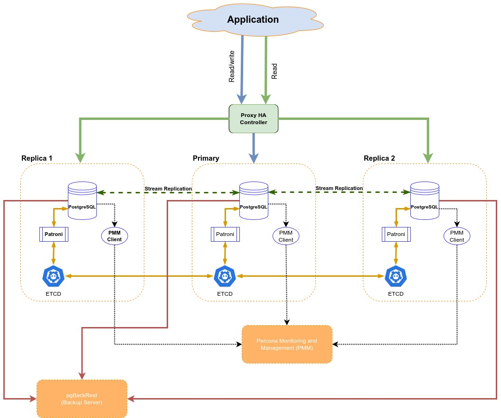

# Ansible recipe/playbook to build a PostgreSQL Cluster with Patroni and ETCD of "N" nodes

This recipe creates a PostgreSQL cluster using Patroni and ETCD of "N" nodes. Please read the configuration instructions to see how you can set up your cluster.

## Architecture

This tool intends to create the below architecture installing and configuring all components:

.

## Before running (Configurations)

Before using this recipe you need to change the configuration in both the `inventory` and `playbooks/group_vars` folders.

 - `inventory`: The inventory folder has the list of servers including the IP address and an ALIAS for each servers. The inventory is divided into 4 files:
   - __etcd_server.yaml__: Contains the list of ETCD nodes
   - __db_server.yaml__: Contains the list of Postgres nodes. Patroni will be installed in the same nodes as Postgres
   - __bkp_server.yaml__: Contains the list of backup servers. We are using pgbackrest for backups
   - __proxy.yaml__: Contains the list of proxy servers. We are using HAProxy in this setup

 - `playbooks/group_vars`: This folder contains the variables used to configure the environment, including here ETCD, Postgres, and Patroni variables. I'm also adding here the IP's of the servers for convenience, but they can be set directly into the `inventory` files. The files here are:
   - __all.yaml__: Contains the *GLOBAL* variables used across all groups, including here the IP and username to  onnect to each server node
   - __etcd_server.yaml__: Contains the list of ETCD related variables and configurations    - __db_server.yaml__: Contains the list of Postgres and Patroni related variables and configurations
   - __bkp_server.yaml__: Contains the list of backup server variables and configurations
   - __proxy.yaml__: Contains the list of proxy server variables and configurations


## How to run

You can run using the script `pgha_install -i` which will run all the playbooks in the correct order or can run an individual playbook, for example: 

``` bash
pgha_install -i -p 4
```

which will install PostgreSQL server and all the HA components like Patroni, ETCD and pgbackrest in the database nodes.

You can run `pgha_install -h` for a complete help.

## Contributions

Please fee free to contribute with PR, feature requests, and bug reports. All contributions are very welcomed!
