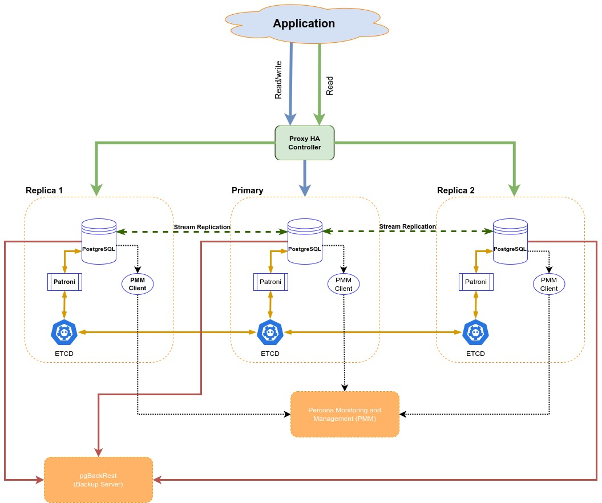

# Patroni: A Template for PostgreSQL HA with ZooKeeper, etcd or Consul

According to its [Github repo[1]](https://github.com/zalando/patroni) Patroni is a template for you to create your own customized, high-availability solution using Python and - for maximum accessibility - a distributed configuration store like ZooKeeper, etcd, Consul or Kubernetes. Database engineers, DBAs, DevOps engineers, and SREs who are looking to quickly deploy HA PostgreSQL in the datacenter-or anywhere else-will hopefully find it useful.

## Architecture

This tutorial intends to guide you on how to create the below architecture following all the steps to install and configure all components:

.

Note that we are using Ubuntu 22 and the Percona Distribution for PostgreSQL 15 in this tutorial but if you want to use the [upstream PGDG packages[2]](https://www.postgresql.org/) you just need to change the package following what is in [PGDG website here[3]](https://www.postgresql.org/download/linux/ubuntu/). We can find the full documentation in about Percona Distribution for Postgres in [Percona's documentation here[4]](https://docs.percona.com/postgresql/15/index.html) including instructions to install in other Linux distros like RedHat.

## Table of Contents

This tutorial will be divided into below steps:
 - [x] [Initial node setup and install the Repo](01-initial_setup.md)
 - [x] [Configure ETCD](02-etcd.md)
 - [x] [Configure Patroni and PostgreSQL](03-patroni.md)
 - [x] [Configure HAProxy](04-haproxy.md)
 - [x] [Configure pgBackRest](05-pgbackrest.md)
 - Configure connection pooler
    - [ ] [pgbouncer](06-pgbouncer.md)
    - [ ] [pgpool](07-pgpool.md)
    - [ ] [pgagroal](08-pgagroal.md)
 - [ ] [Creating a Standby Cluster](09-standby.md)

-----------------------------------------------------------------------------------------------------------------------------------------

## References

[1] https://github.com/zalando/patroni

[2] https://www.postgresql.org/

[3] https://www.postgresql.org/download/linux/ubuntu/

[4] https://docs.percona.com/postgresql/15/index.html
